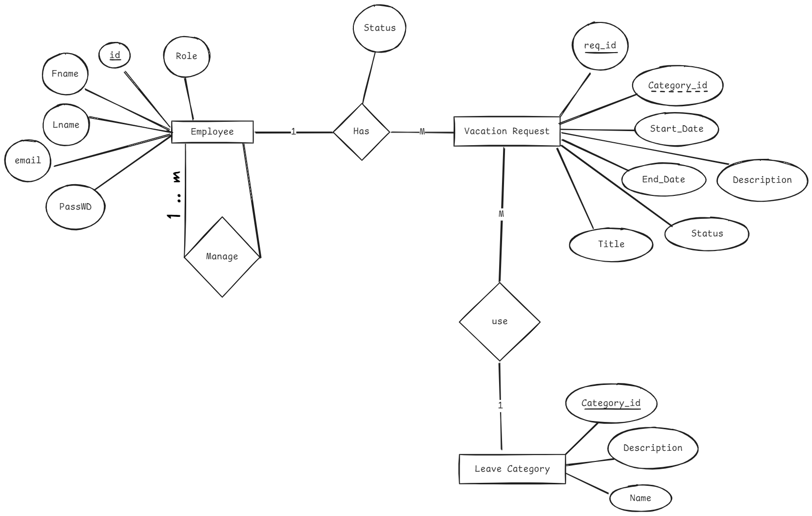
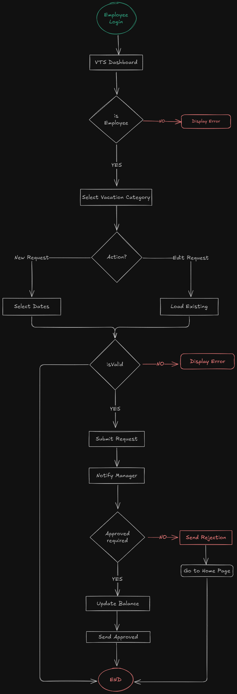

# **Vacation Tracking System - (VST)**
### The Vacation Tracking System Idea is presented in the [Object Oriented Analysis And Design textbook, 3rd edition](https://www.oreilly.com/library/view/object-oriented-analysis-and/9780201895513/).
## 📘 Index
- [Vision](#1-vision)
- [Domain Overview](domain-overview)
- [System Requirements](#system-requirements)
  - [Functional Requirements](#functional-requirements)
  - [Non-Functional Requirements](#non-functional-requirements)
  - [Constraints](#constraints)
- [Actors](#4-actors)
- [Main Use Cases](#5-main-use-cases)
- [Manage Time Use Case Details](#6-manage-time-use-case-details) 
  - ERD
  - [Flow Chart](#flow-chart)
  - [Sequence Diagram](#sequence-diagram)
  - Pseudocode

---

## 1.Vision:
_"A Vacation Tracking System (VTS) Enable employees to self-manage vacation/sick leave without HR intervention while enforcing company policies through automated rules."_

**Key Motivations**:
	- Reduce HR workload.
	- Empower employees with real-time leave balance visibility.
	- Streamline approval processes (e.g., automated rules-based validation).
	- Integrates with existing intranet portal (single sign-on).

> _The System Must be easy use it._

---

## 2.Domain Overview:
Automate employee leave management while enforcing company policies through a rules-based workflow, reducing HR overhead and empowering employees through self-service features.

---
## 3.System Requirements: 
### ✅ Functional Requirements
- Validates vacation requests using flexible rules.
- Some requests may need manager approval.
- Shows vacation history (last year) and lets you request time off up to 18 months ahead.
- Sends email alerts to managers and employees.
- Keeps logs of all user actions.
- HR and system admins can override rules when needed.
- Managers can give extra time off (within limits).
---
### ⚙️ Non-Functional Requirements

- Works with current company hardware and intranet.
- Includes a calendar for choosing dates easily.
- Use single-sign-on (SSO) mechanisms for secure authentication.
- Provides real-time validation feedback.
- Sends instant notifications via email on request status updates.
---
### 🚫 Constraints 

- Must run inside the company’s intranet and use its login system.
- Description field for vacation requests is limited to one paragraph.
- Only allows data access from the past 6 months and up to 18 months into the future.
---
## 4.Actors: 

| Actor        | Responsibilities                         | Key Interactions                       |
| ------------ | ---------------------------------------- | -------------------------------------- |
| Employee     | Create/edit/cancel requests              | Manage Time, View Balances             |
| Manager      | Approve/reject requests, award comp time | Approve Request, Award Time            |
| HR Clerk     | Configure rules, override exceptions     | Edit Employee Record, Manage Locations |
| System Admin | Maintain logs, backups                   | Back Up System Logs                    |

---
## 5.Main Use Cases: 
- [x] **Manage Time** – Request/view leave history and balances. 🔺✅ 2025-05-25
- [ ] **Approve Request** – Approve or reject vacation requests.
- [ ] **Award Time** – Grant additional comp time to subordinates.
- [ ] **Edit Employee Record** – Update leave quotas, limits, or assignments.
- [ ] **Manage Locations** – Administer location-specific rules.
- [ ] **Manage Leave Categories** – Define/mod categories and governing rules.
- [ ] **Override Leave Records** – HR can override system-enforced rejections.
- [ ] **Back Up System Logs** – Backup logs for auditing and recovery.
---
## 6.Manage Time Use-Case Details:

### 🎭 Actor:
- **Employee**
### 🥅 Goal:
- Submit a new vacation request.
### ✅ Preconditions:
- Employee is authenticated and authorized via the intranet portal.

### 📋 Main Flow:
1. Employee opens VTS from the intranet.
2. System displays current requests and leave balances (6 months back to 18 months ahead).
3. Employee creates a new request with:
   - Start/end dates
   - Hours
   - Title
   - Description
4. System validates input:
   - If invalid: errors are shown.
   - If valid: request is submitted and:
     - An approval email is sent (if required).
     - Request status is set to *pending*.
5. Manager receives notification and logs in to review.
6. Manager approves/rejects request (adds reason if rejected).
7. Employee receives status update via email.
---
### ERD (Entity Relationship Diagram):


---
 ### 📊 Flow Chart:


---
### 🔁 Sequence Diagram: 

---
### 📃 Pseudocode
```pseudocode
START

// Step 1: Employee logs into portal
IF employee IS authenticated THEN
    SHOW VTS homepage
    FETCH vacation requests history (last 6 months to next 18 months)
    SHOW vacation balance
ELSE
    DISPLAY "Access Denied"
    END

// Step 2: Employee creates a new request
PROMPT employee TO select vacation category WITH positive balance

IF category IS valid THEN
    PROMPT employee TO select start and end dates, hours per day
    PROMPT employee TO enter title and description

    // Step 3: Validate data
    IF input IS valid THEN
        CREATE new VacationRequest WITH status = "Pending"

        // Step 4: Check if manager approval is required
        IF manager_approval_required THEN
            SEND email TO manager WITH approval link
        ELSE
            SET VacationRequest.status = "Approved"
        ENDIF

        SAVE VacationRequest TO database
        DISPLAY "Request submitted successfully"
    ELSE
        DISPLAY validation errors
        ALLOW employee TO edit or cancel
    ENDIF
ELSE
    DISPLAY "Invalid category or no balance"
ENDIF

END

```

