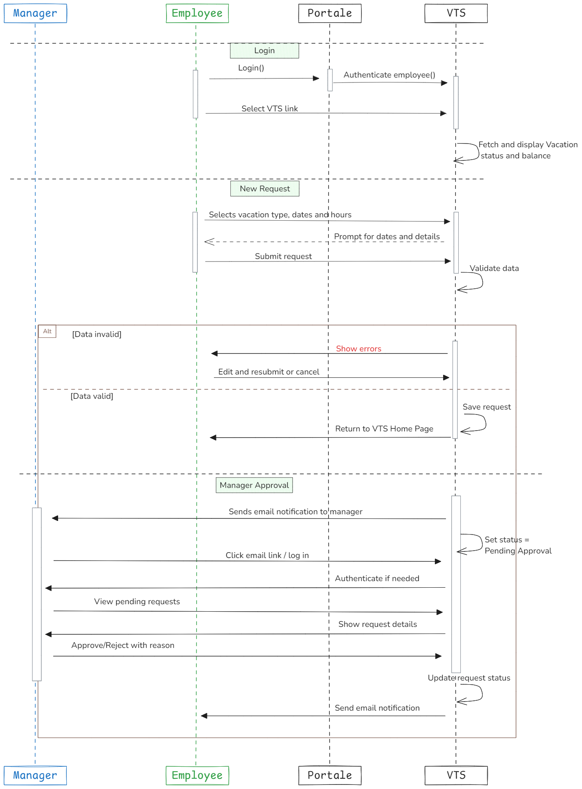

# **Vacation Tracking System (VTS)**

A self-service leave management system based on a case study from the book [_Object-Oriented Analysis and Design, 3rd Edition_](https://www.oreilly.com/library/view/object-oriented-analysis-and/9780201895513/).  
VTS enables employees to manage their vacation and sick leave independently while ensuring compliance with company policies through automated workflows.

## 📘 Index
- [**Vacation Tracking System (VTS)**](#vacation-tracking-system-vts)
  - [📘 Index](#-index)
  - [Vision:](#vision)
  - [Domain Overview:](#domain-overview)
  - [System Requirements:](#system-requirements)
    - [✅ Functional Requirements](#-functional-requirements)
    - [⚙️ Non-Functional Requirements](#️-non-functional-requirements)
    - [🚫 Constraints](#-constraints)
  - [Actors:](#actors)
  - [Main Use Cases:](#main-use-cases)
  - [Manage Time Use-Case Details:](#manage-time-use-case-details)
  - [ERD:](#erd)
  - [📊 Flow Chart:](#-flow-chart)
  - [🔁 Sequence Diagram:](#-sequence-diagram)
  - 📃 Pseudocode: [[manage-time-pseudocode]]
---

## Vision:
_"A Vacation Tracking System (VTS) Enable employees to self-manage vacation/sick leave without HR intervention while enforcing company policies through automated rules."_

**Key Motivations**:
- Reduce HR workload.
- Empower employees with real-time leave balance visibility.
- Streamline approval processes (e.g., automated rules-based validation).
- Integrates with existing intranet portal (single sign-on).

> _The System Must be easy use it._

---

## Domain Overview:
Automate employee leave management while enforcing company policies through a rules-based workflow, reducing HR overhead and empowering employees through self-service features.

---
## System Requirements: 
### ✅ Functional Requirements
- Validates vacation requests using flexible rules.
- Some requests may need manager approval.
- Shows vacation history (last year) and lets you request time off up to 18 months ahead.
- Sends email alerts to managers and employees.
- Keeps logs of all user actions.
- HR and system admins can override rules when needed.
- Managers can give extra time off (within limits).
---
### ⚙️ Non-Functional Requirements

- Works with current company hardware and intranet.
- Includes a calendar for choosing dates easily.
- Use single-sign-on (SSO) mechanisms for secure authentication.
- Provides real-time validation feedback.
- Sends instant notifications via email on request status updates.
---
### 🚫 Constraints 

- Must run inside the company’s intranet and use its login system.
- Description field for vacation requests is limited to one paragraph.
- Only allows data access from the past 6 months and up to 18 months into the future.
---
## Actors: 

| Actor        | Responsibilities                         | Key Interactions                       |
| ------------ | ---------------------------------------- | -------------------------------------- |
| Employee     | Create/edit/cancel requests              | Manage Time, View Balances             |
| Manager      | Approve/reject requests, award comp time | Approve Request, Award Time            |
| HR Clerk     | Configure rules, override exceptions     | Edit Employee Record, Manage Locations |
| System Admin | Maintain logs, backups                   | Back Up System Logs                    |

---
## Main Use Cases: 
- [x] **Manage Time** – Request/view leave history and balances. 🔺✅ 2025-05-25
- [x] **Approve Request** – Approve or reject vacation requests. ✅ 2025-05-29
- [x] **Edit Employee Record** – Update leave quotas, limits, or assignments. ✅ 2025-06-01
- [ ] **Award Time** – Grant additional comp time to subordinates.
- [ ] **Manage Locations** – Administer location-specific rules.
- [ ] **Manage Leave Categories** – Define/mod categories and governing rules.
- [ ] **Override Leave Records** – HR can override system-enforced rejections.
- [ ] **Back Up System Logs** – Backup logs for auditing and recovery.
---
## Manage Time Use-Case Details:

### 🎭 Actor:
- **Employee**
### 🥅 Goal:
- Submit a new vacation request.
### ✅ Preconditions:
- Employee is authenticated and authorized via the intranet portal.

### 📋 Main Flow:
1. Employee opens VTS from the intranet.
2. System displays current requests and leave balances (6 months back to 18 months ahead).
3. Employee creates a new request with:
   - Start/end dates
   - Hours
   - Title
   - Description
4. System validates input:
   - If invalid: errors are shown.
   - If valid: request is submitted and:
     - An approval email is sent (if required).
     - Request status is set to *pending*.
5. Manager receives notification and logs in to review.
6. Manager approves/rejects request (adds reason if rejected).
7. Employee receives status update via email.
---
### ERD:

---
 ### 📊 Flow Chart:
#### Employee Flow

#### Manger Flow

---
### 🔁 Sequence Diagram:
#### Main-Flow
- Manage Time

----
### Alternate Flows:
- Edit Pending Request | Withdraw Request

---
-  Cancel Approved Request

---
